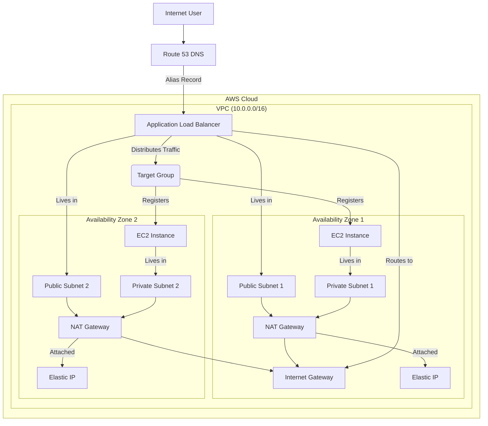

# Terraform AWS Modular Web Application Infrastructure

[](https://www.terraform.io)
[](https://registry.terraform.io/providers/hashicorp/aws/latest)
[](https://opensource.org/licenses/MIT)

This repository contains a production-grade, modular, and reusable Terraform project for deploying a scalable and highly available web application infrastructure on AWS.

## Architecture Diagram

The infrastructure consists of a public-facing Application Load Balancer that distributes traffic to an Auto Scaling Group of EC2 instances running in private subnets across multiple Availability Zones. The instances have outbound internet access via NAT Gateways.



## Features

-   **Modular Design**: Infrastructure is broken down into reusable modules (VPC, ALB, Auto Scaling, IAM, Route 53).
-   **Environment Separation**: Easily manage multiple environments (e.g., `dev`, `prod`) with distinct configurations.
-   **Remote State Management**: Uses an S3 backend for state storage and a DynamoDB table for state locking.
-   **Best Practices**: Follows Terraform best practices for security, reliability, and maintainability.
-   **Scalability & HA**: Implements an Auto Scaling Group and an Application Load Balancer across multiple AZs.

## ⚠️ Cost Warning

Deploying this infrastructure will incur costs on your AWS account. The primary cost drivers are the NAT Gateways (one per AZ), the Application Load Balancer, and the EC2 instances. For development, consider setting `enable_nat_gateway = false` in the VPC module call and using `t3.micro` instance types to minimize costs. **Always destroy the infrastructure when not in use.**

## Prerequisites

1.  **Terraform CLI**: `v1.0.0` or newer.
2.  **AWS Account** with the necessary permissions (IAM, EC2, VPC, S3, DynamoDB, Route 53, ACM).
3.  **AWS CLI**: Configured with your credentials (`aws configure`).
4.  **A Registered Domain**: A domain name with its DNS managed by a **Route 53 Public Hosted Zone**.
5.  **ACM SSL Certificate**: A validated ACM certificate in the **same region** as your deployment, covering your domain (e.g., `*.example.com`).

## Setup: Remote Backend

This project uses S3 for remote state storage and DynamoDB for state locking. You must create these resources **once** before deployment.

1.  **Create S3 Bucket** (choose a unique name):
    ```sh
    aws s3api create-bucket --bucket YOUR_UNIQUE_BUCKET_NAME --region YOUR_REGION
    ```

2.  **Enable Versioning**:
    ```sh
    aws s3api put-bucket-versioning --bucket YOUR_UNIQUE_BUCKET_NAME --versioning-configuration Status=Enabled
    ```

3.  **Create DynamoDB Table**:
    ```sh
    aws dynamodb create-table \
        --table-name YOUR_DYNAMODB_TABLE_NAME \
        --attribute-definitions AttributeName=LockID,AttributeType=S \
        --key-schema AttributeName=LockID,KeyType=HASH \
        --provisioned-throughput ReadCapacityUnits=1,WriteCapacityUnits=1
    ```

## Deployment Instructions

1.  **Navigate to an Environment**:
    ```sh
    cd environments/dev
    ```

2.  **Configure Backend**: Edit `backend.tf` and replace the placeholder values for `bucket`, `region`, and `dynamodb_table`.

3.  **Create Variables File**: Copy the example and fill in your specific values.
    ```sh
    cp terraform.tfvars.example terraform.tfvars
    # Now edit terraform.tfvars
    ```

4.  **Initialize Terraform**:
    ```sh
    terraform init
    ```

5.  **Plan Deployment**: Review the changes before applying.
    ```sh
    terraform plan -var-file="terraform.tfvars"
    ```

6.  **Apply Deployment**: Build the infrastructure.
    ```sh
    terraform apply -var-file="terraform.tfvars" --auto-approve
    ```
    After completion, the `application_url` will be displayed in the outputs.

## Destroying Infrastructure

To avoid ongoing charges, destroy the infrastructure when you're done.
```sh
terraform destroy -var-file="terraform.tfvars"
```

## Modules Documentation

### `vpc`
Creates the networking foundation.
| Input | Description | Type |
| :--- | :--- | :--- |
| `project_name` | Name of the project for tagging. | `string` |
| `environment` | Environment name (e.g., `dev`). | `string` |
| `vpc_cidr_block` | Main CIDR block for the VPC. | `string` |
| `public_subnet_cidrs` | List of CIDRs for public subnets. | `list(string)` |
| `private_subnet_cidrs` | List of CIDRs for private subnets. | `list(string)` |

| Output | Description |
| :--- | :--- |
| `vpc_id` | The ID of the created VPC. |
| `public_subnet_ids` | List of public subnet IDs. |
| `private_subnet_ids` | List of private subnet IDs. |

---
### `iam`
Creates the necessary IAM roles for EC2 instances.
| Output | Description |
| :--- | :--- |
| `ec2_instance_profile_name` | The name of the created EC2 instance profile. |

---
### `alb`
Provisions an Application Load Balancer and its related components.
| Input | Description | Type |
| :--- | :--- | :--- |
| `vpc_id` | ID of the VPC to deploy into. | `string` |
| `public_subnet_ids` | Subnets for the ALB. | `list(string)` |
| `acm_certificate_arn` | ARN of the SSL certificate. | `string` |

| Output | Description |
| :--- | :--- |
| `alb_dns_name` | The public DNS name of the ALB. |
| `alb_zone_id`| The route 53 zone ID of the ALB. |
| `web_target_group_arn`| ARN of the primary target group. |
| `alb_sg_id` | ID of the ALB's security group. |

---
### `autoscaling`
Creates a launch template and an auto-scaling group for the web servers.
| Input | Description | Type |
| :--- | :--- | :--- |
| `vpc_id` | ID of the VPC. | `string` |
| `private_subnet_ids` | Subnets for the EC2 instances. | `list(string)` |
| `instance_type`| The EC2 instance type (e.g. `t3.micro`). | `string` |
| `iam_instance_profile_name` | Name of the instance profile from the IAM module. | `string` |
| `web_target_group_arn` | ARN of the target group from the ALB module. | `string` |

---
### `route53`
Manages the DNS record pointing to the Application Load Balancer.
| Input | Description | Type |
| :--- | :--- | :--- |
| `domain_name` | The registered domain name (e.g., `example.com`). | `string` |
| `app_dns_name`| The subdomain for the app (e.g., `www`, `dev.app`). | `string` |
| `alb_dns_name`| The DNS name of the ALB. | `string` |
| `alb_zone_id` | The zone ID of the ALB. | `string` |

| Output | Description |
| :--- | :--- |
| `app_url` | The final FQDN of the application. |

## License
This project is licensed under the MIT License - see the [LICENSE](LICENSE) file for details.